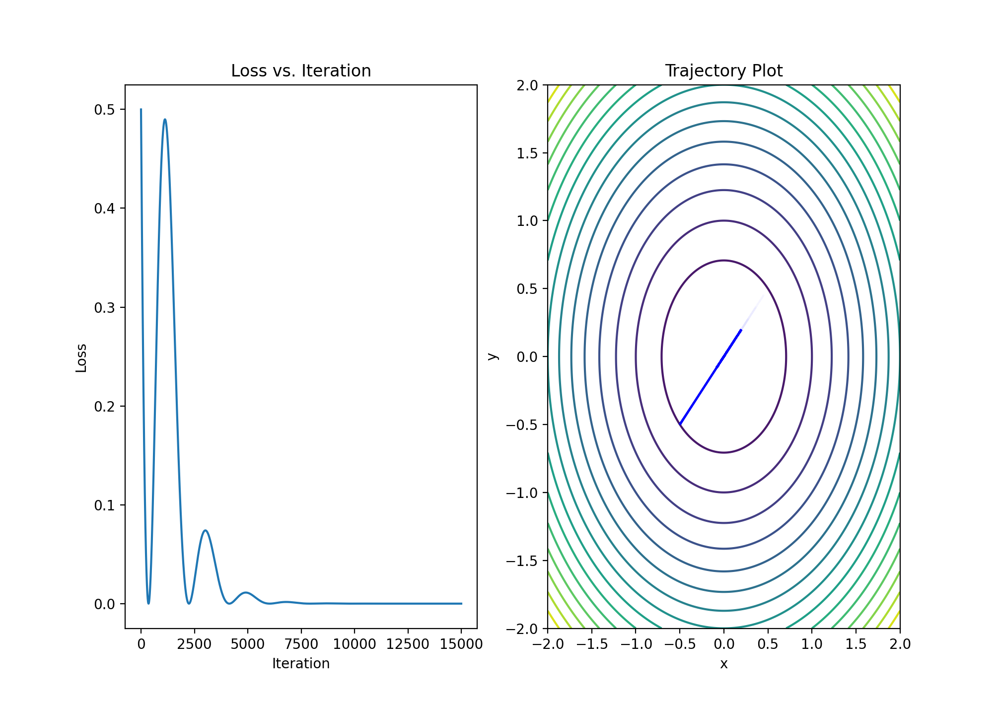

<hr/>

[](https://github.com/yashpatel5400/CurveTorch/actions?query=workflow%3ALint)
[](https://github.com/yashpatel5400/CurveTorch/actions?query=workflow%3ATest)
[](https://github.com/yashpatel5400/CurveTorch/actions?query=workflow%3ADocs)
[](LICENSE)


CurveTorch is a library for Self-Tuning Stochastic Optimization with
Curvature-Aware Gradient Filtering built on PyTorch.

*CurveTorch is currently in beta and under active development!*


#### Why CurveTorch ?
CurveTorch
* Provides a modular and easily extensible interface for self-tuning optimizer
* Harnesses the power of PyTorch, including auto-differentiation, native support
  for highly parallelized modern hardware (e.g. GPUs) using device-agnostic code,
  and a dynamic computation graph.
* Enables seamless integration with deep and/or convolutional architectures in PyTorch.


#### Target Audience

The primary audience for hands-on use of CurveTorch are researchers and
sophisticated practitioners in Optimization and AI.
We recommend using CurveTorch as a low-level API for optimization researchers to 
plug into research on Stochastic Optimization with Curvature-Aware Gradient Filtering
and related works.

## Installation

**Installation Requirements**
- Python >= 3.7
- PyTorch >= 1.9
- scipy


##### Installing the latest release

You can customize your PyTorch installation (i.e. CUDA version, CPU only option)
by following the [PyTorch installation instructions](https://pytorch.org/get-started/locally/).

***Important note for MacOS users:***
* Make sure your PyTorch build is linked against MKL (the non-optimized version
  of CurveTorch can be up to an order of magnitude slower in some settings).
  Setting this up manually on MacOS can be tricky - to ensure this works properly,
  please follow the [PyTorch installation instructions](https://pytorch.org/get-started/locally/).
* If you need CUDA on MacOS, you will need to build PyTorch from source. Please
  consult the PyTorch installation instructions above.


##### Installing from latest main branch

If you would like to try our bleeding edge features (and don't mind potentially
running into the occasional bug here or there), you can install the latest
development version directly from GitHub (this will also require installing
the current PyTorch development version):
```bash
pip install --upgrade git+https://github.com/yashpatel5400/CurveTorch.git
```

**Manual / Dev install**

Alternatively, you can do a manual install. For a basic install, run:
```bash
git clone https://github.com/yashpatel5400/CurveTorch.git
cd CurveTorch
pip install -e .
```

To customize the installation, you can also run the following variants of the
above:
* `pip install -e .[dev]`: Also installs all tools necessary for development
  (testing, linting, docs building; see [Contributing](#contributing) below).
* `pip install -e .[tutorials]`: Also installs all packages necessary for running the tutorial notebooks.


## Getting Started

Here's a quick run down of the main component of CurveSGD.
For more details see our [Documentation](https://CurveTorch.org/docs/introduction) and the
[Tutorials](https://CurveTorch.org/tutorials).

```python
  import torch
  import curvetorch as curve

  for _ in range(iterations):
    def closure():
        optimizer.zero_grad()
        f = func(x)
        f.backward(retain_graph=True, create_graph=True)
        return f
    optimizer.step(closure)
  ```

To run the suite of unit tests (and recreate the figures provided in the accompanying document), simply run (from the repo root):

```python
pytest
```


## CurveTorch Results

Here are results on some known optimization tests:

### Quadratic Convergence
```python
def quadratic(x, y):
    a = 1.0
    b = 1.0
    return (x ** 2) / a + (y ** 2) / b
```


## Citing CurveTorch

If you use CurveTorch, please cite the following paper:

```
@article{chen2020self,
  title={Self-tuning stochastic optimization with curvature-aware gradient filtering},
  author={Chen, Ricky TQ and Choi, Dami and Balles, Lukas and Duvenaud, David and Hennig, Philipp},
  year={2020},
  publisher={PMLR}
}
```


## Contributing
See the [CONTRIBUTING](CONTRIBUTING.md) file for how to help out.


## License
CurveTorch is MIT licensed, as found in the [LICENSE](LICENSE) file.
